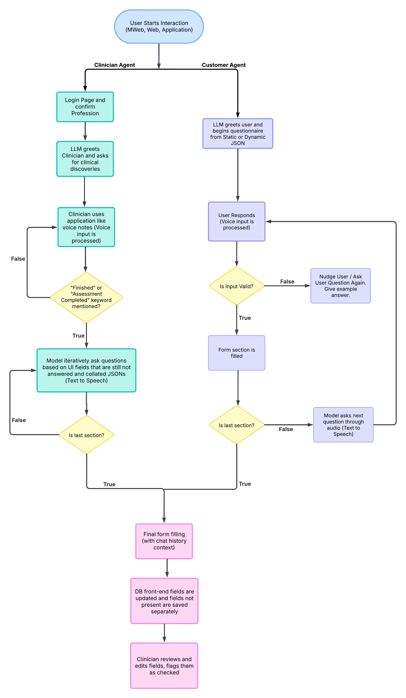

# Information for this branch
1. ffmpeg must be installed for speeding up gtts audio for gradio ui, cli tts is normal paced.
2. Used modules are present in requirements.txt
3. MongoDB must be installed ("Community" edition installed as a "Service")
4. NOTE: Will not be dealing with dynamic JSON forms for this agent
5. Google Gemini API must be present in config/config_key.txt
6. Added VAD (Voice Activation Detection) for detecting silence.
7. Integrated VAD through whisper-base for better transcription.

Below you can find the overall goal of the project being developed...

# Project 1 - Information Automation Agent

## Overview
The **Information Automation Agent** is an AI-driven **intelligent form-filling assistant** designed for **web, mobile web (MWeb), and mobile applications**. It enables seamless data entry using voice commands, automatically filling structured forms for **patients** and **clinicians** based on predefined JSON templates.

This project leverages **Retrieval-Augmented Generation (RAG)**, where a **Large Language Model (LLM)** is trained to behave like a **clinician** while filling forms dynamically. The model references a **vector database** containing **Bachelor’s (BPT), Master’s (MPT), Strength & Conditioning (S&C) curriculums, and research papers** to ensure accuracy in assessments.

---
## Key Features
- **Voice-Driven Interaction** – Users interact using voice inputs.
- **Intelligent Form Filling** – LLM ensures forms are completed fully before submission.
- **Context-Aware Dynamic Forms** – Custom JSON forms generated based on user type (Customer, Physiotherapist, Strength & Conditioning Coach).
- **Error Handling & Guidance** – Provides real-time feedback to prevent incomplete or irrelevant entries.
- **Automated Validation & UI Integration** – Clinicians verify model-filled forms before final submission.
- **Seamless Database Updates** – Updates only relevant UI fields in the database.

---
## System Architecture


### 1. Customer Agent Flow
1. **User starts interaction** via the app, web extension, or MWeb.
2. **Speech-to-Text Model (Whisper)** converts voice input to text.
3. **RAG-powered LLM** asks questions (from JSON template) and interprets responses.
4. If a **response is irrelevant**, the model **guides the user** back to the topic.
5. **Valid inputs populate the JSON form**.
6. The process **continues until all fields are filled**.
7. The **filled form updates the database**.
8. **Clinician reviews and validates** the data.

### 2. Clinician Agent Flow
1. **Clinician logs in** to the system.
2. The agent **waits for the clinician’s input**, transcribing voice into structured data.
3. **SOAP Framework: First vs. Subsequent Assessments**
   - **First assessment**: **Subjective, Objective, and Assessment** are required.
   - **Subsequent assessments**: **SOAP (Subjective, Objective, Assessment, Planning)** is mandatory.
4. The model **parses voice input**, filling forms dynamically.
5. If UI fields are missing, the **model requests the clinician’s input**.
6. Once the clinician signals completion (e.g., "That’s it"), the form updates the database.
7. The clinician **reviews and validates** the data.

---
## Core Functionalities

### 1. **Automated Form Handling**
- The model **ensures all form fields are filled** before submission.
- For **network disruptions**, the session resumes from the **last unanswered question**.
- If **manual intervention is needed**, clinicians can **edit fields manually**.

### 2. **RAG-Powered Contextual Responses**
- Uses a **vector database** for **BPT, MPT, and S&C** references.
- Prompt engineering ensures **questions are interpreted in one way**.
- Avoids **irrelevant information** and guides users back to the topic.

### 3. **Speech-to-Text & Text-to-Speech**
- **Prototype:** Whisper (open-source Speech-to-Text model).
- **Production:** Exploring paid, high-accuracy models.
- **Text-to-Speech:** Yet to be implemented.

### 4. **Real-Time Database Updates**
- Updates **only UI-relevant fields**.
- **Stores complete filled JSONs** separately for auditing.
- Supports **fallback to manual editing**.

---
## High-Level Workflow

**Customer Agent:**
1. User interacts via **app/MWeb/web**.
2. **LLM guides the conversation**, ensuring form completion.
3. **User voice input is transcribed & validated**.
4. The form is **filled dynamically**.
5. The **clinician validates the final form**.

**Clinician Agent:**
1. **Clinician speaks freely**.
2. LLM **transcribes and fills the form**.
3. If UI fields are missing, **LLM requests details**.
4. Clinician **confirms completion**.
5. Form updates **only relevant database fields**.

---
## Summary
- **No incomplete forms** – LLM ensures all fields are filled.
- **Customer Agent**: Structured **questionnaire-based form-filling**.
- **Clinician Agent**: **Freeform voice-to-data transcription**.
- **Manual Edit Support** – Clinicians can adjust entries if needed.
- **Efficient Data Storage & Updates** – Only relevant UI fields update the database.

---
## S3 Storage Setup

1. **Create a bucket** in the AWS region closest to your users (e.g., `us-east-1`). Disable public access only if you plan to serve files via signed URLs.
2. **IAM Policy** – create a user or role with at least `s3:PutObject`, `s3:GetObject`, and `s3:DeleteObject` for the bucket prefix `forms/*`. Save the access key/secret locally.
3. **Environment variables** – set the following in `DataHandling/.env`:
   ```
   AWS_ACCESS_KEY_ID=your-access-key
   AWS_SECRET_ACCESS_KEY=your-secret
   AWS_S3_REGION=us-east-1
   S3_BUCKET_NAME=your-bucket
   ```
4. **CORS** – if the frontend uploads directly to S3 later, configure the bucket CORS rules to allow `PUT`/`GET` from your domain (`https://client.example.com`).
5. **Lifecycle (optional)** – add a lifecycle policy to automatically transition old uploads to Glacier or delete them after review.