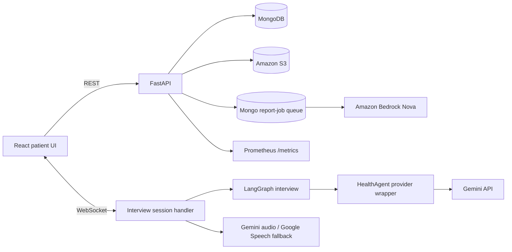

# Stance Health Customer Agent

Stance Health Customer Agent is an AI-assisted musculoskeletal-health intake
application. A patient opens a clinician-provided link, completes a conversational
FRM-01 intake or assigned PROM assessment, optionally dictates answers and uploads
medical reports, and has progress persisted in MongoDB for later clinical use.

This repository contains the FastAPI backend in `DataHandling/`. The React/Vite
frontend is maintained in the sibling directory `../customer-agent-frontend/`.

## Current capabilities

- conversational intake over WebSocket, orchestrated primarily by LangGraph;
- FRM-01 collection, resume, progress calculation, summary, and correction flow;
- assigned PROM question delivery for non-default form IDs;
- typed answers, structured PROM answers, and recorded-audio transcription;
- Gemini primary transcription with Google Cloud Speech fallback;
- bounded report upload to S3 and durable Bedrock report-summary jobs;
- MongoDB form lifecycle (`draft`, `in_progress`, `completed`);
- privacy-safe Prometheus AI call, token, latency, error, and cost telemetry;
- optional, explicitly enabled Langfuse and MCP integrations.

There is currently **no question-management/admin CRUD system** in this
application. PROM questions are read from existing data attached to a patient/form.
Adding, editing, categorising, publishing, or deleting clinical questions is a
separate product capability requiring authentication, roles, audit history,
instrument versioning, and clinical governance.

## Architecture



Important implementation boundaries:

- `DataHandling/server.py` owns the current HTTP/WebSocket composition and
  application lifecycle.
- `DataHandling/src/graph/` owns the primary interview state machine.
- `DataHandling/src/llm/functionalities.py` contains the shared Gemini wrapper
  and the retained legacy fallback engine.
- `DataHandling/app/` contains extracted configuration, database, form,
  upload, job, runtime, WebSocket, AI-model, and observability policies.
- `DataHandling/docscanner/` validates/renders reports and calls Bedrock.
- `DataHandling/upload/` provides S3 integration.

MongoDB is the persistent source of truth. LangGraph checkpoint/session state and
WebSocket idempotency remain in-process, so the current service is not ready for
uncoordinated multi-worker scaling.

## Documentation

- [Current REST and WebSocket contract](DataHandling/docs/PUBLIC_API.md)
- [Local development and verification](DataHandling/docs/LOCAL_DEV.md)
- [Deployment configuration and checks](DataHandling/docs/DEPLOYMENT.md)
- [Isolated development deployment](DataHandling/docs/DEV_ISOLATED_DEPLOYMENT.md)

## Local start

Prerequisites are Docker Compose and access to non-production MongoDB/provider
credentials. Secrets are intentionally not committed.

```bash
cp DataHandling/.env.example DataHandling/.env
# Fill only non-production credentials in DataHandling/.env.
docker compose up -d --build
docker compose logs -f healthflex-agent
```

The backend listens on `http://localhost:8000`. Useful checks:

```bash
curl http://localhost:8000/health
curl http://localhost:8000/metrics
cd DataHandling
python3 -m unittest discover -s tests
```

Start the frontend separately:

```bash
cd ../customer-agent-frontend
cp .env.example .env.local
npm install
npm run dev
```

The frontend template defaults to backend HTTP `localhost:8000`, WebSocket
`ws://localhost:8000`, and the Vite development server (normally port 8080).

## Access and test-data warning

The customer-agent currently relies on the existing external consent flow: the
consent application performs its OTP process and writes the accepted consent
record, and the frontend checks that record before enabling the interview. The
customer-agent does not currently require its own access token. Do not expose a
local instance publicly or use a production patient database for development or
automated tests. A patient ID in a URL is not an independent authentication
credential.

Never commit `.env`, Google credential JSON, AWS secrets, MongoDB credentials,
patient exports, reports, audio, transcripts, or observability content containing
patient information.

## Verification commands

Backend:

```bash
cd DataHandling
python3 -m compileall -q app docscanner src server.py
python3 -m unittest discover -s tests
python3 tests/smoke.py  # requires the backend to be running
```

Frontend:

```bash
cd ../customer-agent-frontend
npx tsc -b
npm run lint
npm run build
npm audit
```

Deployment validation against non-production MongoDB, S3, Bedrock, Gemini, and
Google Speech remains required; unit tests use fakes and do not prove provider
credentials, model access, region compatibility, quotas, or production topology.
